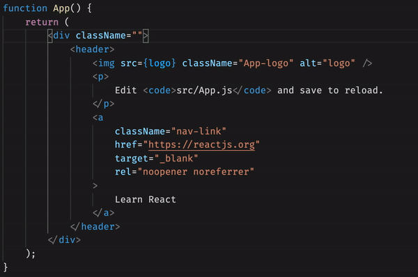

# External Class Suggestions Extension

This extension reads external stylesheets and suggests class names when editing the className attribute in JSX/TSX files. This extension is based off of [HTMLClassSuggestionsVSCode](https://github.com/andersea/HTMLClassSuggestionsVSCode).

## Features



By default, the extension fetches the CSS from Bootstrap, but this can be configured under `"external-class-suggestions.externalStylesheets"` by either adding to the array of URLs or replacing the Bootstrap URL.

## Installation

Clone this project and generate its package.

```console
git clone https://github.com/lucasgrinspan/external-class-suggestions.git
cd external-class-suggestions
npm install
npm run build
```

This will create a `.vsix` file in the root of the project directory. This extension file can be installed with

```console
code --install-extension external-class-suggestions-1.0.0.vsix
```

If you can't generate the `.vsix` file, you can download it from the [Releases Tab](https://github.com/lucasgrinspan/external-class-suggestions/releases).

## Extension Settings

-   `external-class-suggestions.externalStylesheets`: External stylesheets to load suggestions from

## Release Notes

### 1.0.0

Initial release
